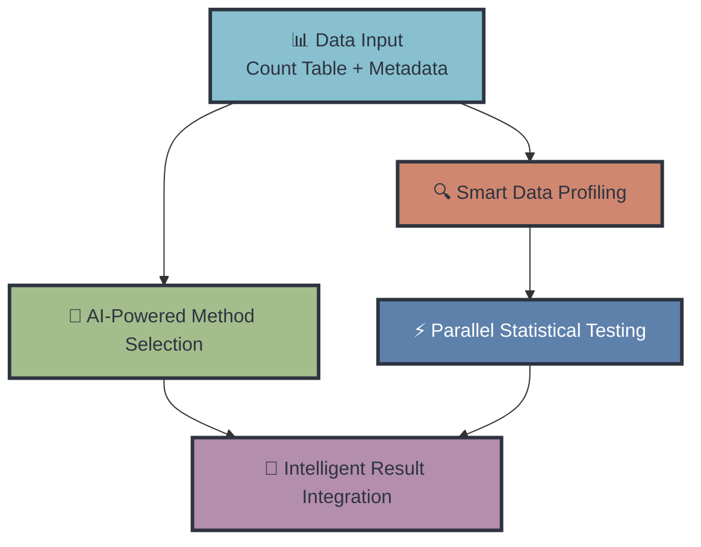
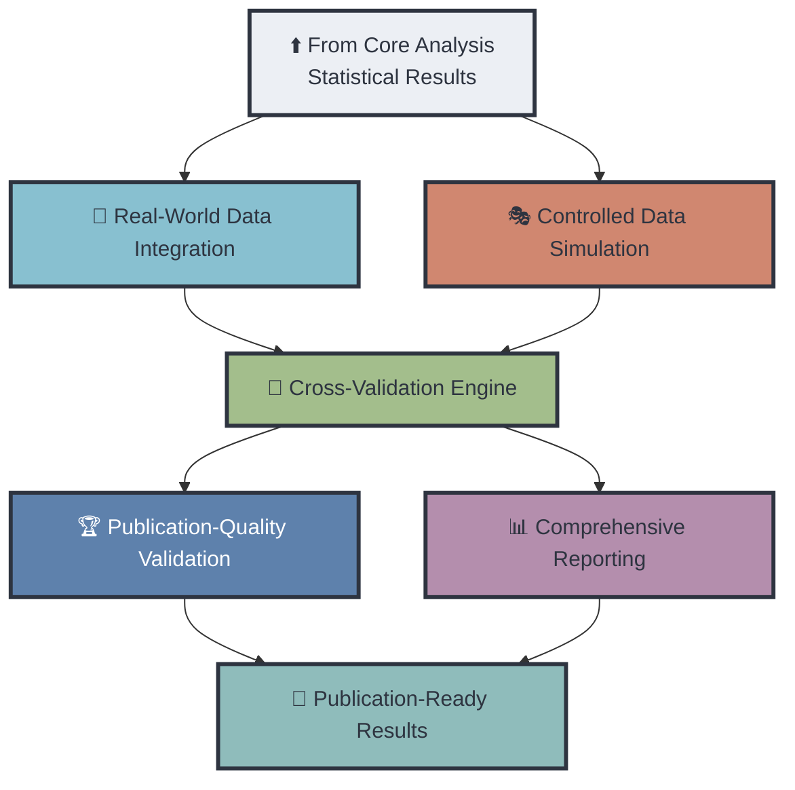

# DAAadvisor Workflow Diagrams in Mermaid

## Core Analysis Framework

```mermaid
flowchart TD
    %% Input
    A[📊 Data Input<br/>Count Table + Metadata] --> B[🔍 Smart Data Profiling]
    A --> C[🧠 AI-Powered Method Selection]
    
    %% Core processes
    B --> D[⚡ Parallel Statistical Testing]
    C --> E[🤝 Intelligent Result Integration]
    D --> E
    
    %% Styling
    A:::input
    B:::profiling
    C:::selection
    D:::analysis
    E:::consensus
    
    %% Class definitions
    classDef input fill:#88C0D0,stroke:#2E3440,stroke-width:3px,color:#2E3440
    classDef profiling fill:#D08770,stroke:#2E3440,stroke-width:3px,color:#2E3440
    classDef selection fill:#A3BE8C,stroke:#2E3440,stroke-width:3px,color:#2E3440
    classDef analysis fill:#5E81AC,stroke:#2E3440,stroke-width:3px,color:#fff
    classDef consensus fill:#B48EAD,stroke:#2E3440,stroke-width:3px,color:#2E3440
```

## Validation Framework

```mermaid
flowchart TD
    %% Input from core
    A[⬆️ From Core Analysis<br/>Statistical Results] --> B[🧬 Real-World Data Integration]
    A --> C[🎭 Controlled Data Simulation]
    
    %% Cross-validation
    B --> D[🔄 Cross-Validation Engine]
    C --> D
    
    %% Output processes
    D --> E[🏆 Publication-Quality Validation]
    D --> F[📊 Comprehensive Reporting]
    
    %% Final output
    E --> G[🎯 Publication-Ready Results]
    F --> G
    
    %% Styling
    A:::input
    B:::real_data
    C:::synthetic
    D:::cross_val
    E:::validation
    F:::reporting
    G:::output
    
    %% Class definitions
    classDef input fill:#ECEFF4,stroke:#2E3440,stroke-width:3px,color:#2E3440
    classDef real_data fill:#88C0D0,stroke:#2E3440,stroke-width:3px,color:#2E3440
    classDef synthetic fill:#D08770,stroke:#2E3440,stroke-width:3px,color:#2E3440
    classDef cross_val fill:#A3BE8C,stroke:#2E3440,stroke-width:3px,color:#2E3440
    classDef validation fill:#5E81AC,stroke:#2E3440,stroke-width:3px,color:#fff
    classDef reporting fill:#B48EAD,stroke:#2E3440,stroke-width:3px,color:#2E3440
    classDef output fill:#8FBCBB,stroke:#2E3440,stroke-width:3px,color:#2E3440
```